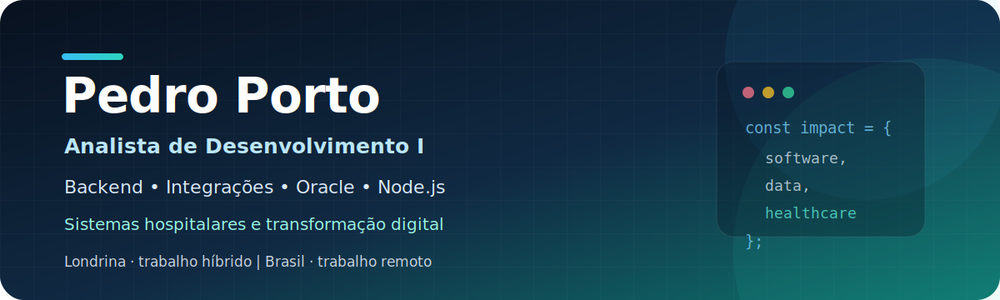

<p align="center">
  
</p>

<p align="center">
  <a href="https://www.linkedin.com/in/ppremium-data/">
    
  </a>
  <a href="mailto:ppremium_data@outlook.com">
    
  </a>
  <a href="https://github.com/pedrolporto?tab=repositories">
    
  </a>
</p>

## Sobre mim

Sou **Analista de Desenvolvimento I e profissional full stack**, com trajetória em tecnologia iniciada em 2014. Minha atuação integra desenvolvimento de software, experiência do usuário, dados, Business Intelligence, automação e compreensão de negócio.

Desenvolvo soluções completas: investigo o problema, compreendo o fluxo operacional, estruturo os dados, desenho a experiência, implemento interfaces e serviços, integro sistemas e acompanho o resultado em produção.

No ambiente hospitalar, atuo em processos críticos que exigem confiabilidade, clareza, segurança e aderência a regras de negócio. Ingressei como Analista de Desenvolvimento Trainee em janeiro de 2025 e fui promovido para **Analista de Desenvolvimento I em maio de 2026**.

> Transformo problemas complexos em experiências digitais claras, soluções técnicas sustentáveis e informações úteis para decisão.

## Portfólio técnico

Os repositórios abaixo apresentam **estudos de caso profissionais documentados**, com arquitetura conceitual, decisões técnicas, UX/UI, exemplos sintéticos, segurança e resultados observados. Código corporativo, credenciais, dados assistenciais e estruturas internas não são publicados.

<table>
<tr>
<td width="50%" valign="top">

### [AIH Digital](https://github.com/pedrolporto/case-aih-digital)

Digitalização do fluxo de Autorizações de Internação Hospitalar, com auditoria, lotes, rastreabilidade e integração hospitalar.

**Demonstra**

- Desenvolvimento full stack
- Modelagem de fluxo operacional
- UX para processos críticos
- Oracle e integrações
- Auditoria e segurança
- Faturamento SUS

**Tecnologias**

`Node.js` `Express` `JavaScript` `Oracle` `Knex` `JWT` `Socket.IO`

</td>
<td width="50%" valign="top">

### [Tempo de Espera Hospitalar](https://github.com/pedrolporto/case-tempo-espera-hospitalar)

Indicadores públicos e gerenciais para acompanhamento de tempos de atendimento, com diferentes modelos de leitura operacional e executiva.

**Demonstra**

- Full stack e visualização
- Arquitetura orientada a dados
- UX para múltiplos públicos
- Cache e desacoplamento
- Segurança e observabilidade
- Publicação de aplicações

**Tecnologias**

`Node.js` `Express` `Oracle` `SQLite` `Knex` `JWT` `Pino` `Helmet`

</td>
</tr>
<tr>
<td width="50%" valign="top">

### [PRIME](https://github.com/pedrolporto/case-prime)

Plataforma de relacionamento, pontuação, ciclos, benefícios e experiência digital para o corpo clínico.

**Demonstra**

- Produto digital e UX/UI
- Jornadas de usuário e administração
- Dados, indicadores e regras
- Aplicação responsiva e PWA
- Notificações e comunicação
- Integração e automação

**Tecnologias**

`Node.js` `Express` `EJS` `Oracle` `MariaDB` `Redis` `PWA` `Web Push`

</td>
<td width="50%" valign="top">

### [NDEX — Núcleo de Dados Extensível](https://github.com/pedrolporto/case-api-ndex)

API institucional extensível para centralizar integrações autorizadas, permissões, cache, auditoria e documentação.

**Demonstra**

- Arquitetura de APIs
- Autenticação e autorização
- Cibersegurança aplicada
- Cache e rate limiting
- Auditoria e observabilidade
- Documentação automatizada

**Tecnologias**

`Node.js` `Express` `Oracle` `SQLite` `Knex` `HMAC` `Rate Limit` `Testes`

</td>
</tr>
<tr>
<td width="50%" valign="top">

### [SAS E-mail](https://github.com/pedrolporto/case-sas-email)

Automação para leitura, classificação, consolidação e publicação controlada de informações recebidas por e-mail.

**Demonstra**

- Automação de processos
- Integração Node.js e Python
- Aplicação controlada de IA
- Orquestração e tolerância a falhas
- Auditoria de execução
- Integração com arquivos e rede

**Tecnologias**

`Node.js` `Python` `IMAP` `IA via API` `XLSX` `SQLite` `CRON` `SMB`

</td>
<td width="50%" valign="top">

### Confidencialidade por projeto

Cada case utiliza uma apresentação sanitizada, com:

- Dados sintéticos
- Interfaces recriadas
- Diagramas em alto nível
- Exemplos fictícios
- Ausência de credenciais
- Omissão da topologia interna
- Separação entre contribuição individual e trabalho da equipe

O objetivo é demonstrar **raciocínio, arquitetura, experiência e impacto**, preservando propriedade intelectual e segurança institucional.

</td>
</tr>
</table>

## Meu diferencial

Meu perfil não está restrito a uma única camada da tecnologia. Trabalho na conexão entre quatro competências:

<table>
<tr>
<td width="50%" valign="top">

### Desenvolvimento full stack

- Node.js, Express e APIs REST
- JavaScript e TypeScript
- PHP e Python
- HTML5 e CSS3
- Oracle SQL e PL/SQL
- Integração entre sistemas
- Linux, Nginx, PM2 e CRON

</td>
<td width="50%" valign="top">

### UX, UI e experiência digital

- Arquitetura da informação
- Organização de fluxos e jornadas
- Interfaces responsivas
- Hierarquia visual
- Clareza e acessibilidade
- Prototipação e refinamento
- Tradução de regras complexas para o usuário

</td>
</tr>
<tr>
<td width="50%" valign="top">

### Dados e Business Intelligence

- Modelagem e tratamento de dados
- ETL e qualidade da informação
- Power BI e dashboards
- Indicadores e métricas
- Visualização de dados
- Storytelling analítico
- Apoio à decisão estratégica

</td>
<td width="50%" valign="top">

### Negócio, integração e transformação

- Sistemas hospitalares e corporativos
- MV e TOTVS RM
- Faturamento SUS e fluxos de AIH
- Automação de processos
- Levantamento de requisitos
- Documentação funcional e técnica
- Comunicação com stakeholders

</td>
</tr>
</table>

## Tecnologias e práticas

<p>
  
  
  
  
  
  
  
  
  
  
  
  
</p>

| Dimensão | Competências |
|---|---|
| **Frontend e experiência** | JavaScript, TypeScript, HTML5, CSS3, interfaces responsivas, hierarquia visual, usabilidade e arquitetura da informação |
| **Backend e integrações** | Node.js, Express, APIs REST, PHP, Python, processamento de arquivos e integração entre sistemas |
| **Bancos de dados** | Oracle SQL, PL/SQL, views, functions, triggers, modelagem e otimização de consultas |
| **Dados e BI** | ETL, Power BI, dashboards, indicadores, visualização e análise de dados |
| **Infraestrutura de aplicações** | Linux Server, Nginx, PM2, CRON, WinSCP e familiaridade inicial com Docker |
| **Negócio** | Sistemas hospitalares, MV, TOTVS RM, faturamento SUS, requisitos, documentação e melhoria de processos |

## Outros projetos públicos selecionados

| Projeto | Competências demonstradas |
|---|---|
| **[Desafio SQL para Gestão Hospitalar](https://github.com/pedrolporto/desafio_sqlite_hospital)** | SQL, modelagem relacional, raciocínio analítico e domínio hospitalar |
| **[iFood Business Intelligence Challenge](https://github.com/pedrolporto/ifood_data_analysis)** | Python, Power BI, KPIs, churn, retenção, LTV, CAC e storytelling de dados |
| **[CRUD estruturado em PHP](https://github.com/pedrolporto/site_php_estruturado)** | Desenvolvimento web, persistência de dados, interface e operações CRUD |
| **[Google Store Analytics](https://github.com/pedrolporto/google_store)** | Power BI, análise de desempenho, hierarquia visual e narrativa orientada a dados |
| **[Dashboard de campanhas no Looker](https://github.com/pedrolporto/looker_dashboard)** | Visualização interativa, métricas de campanha e comunicação executiva |

## Como penso soluções

```text
Problema de negócio
        ↓
Compreensão do usuário e do processo
        ↓
Dados, regras e arquitetura da informação
        ↓
Experiência, interface e implementação
        ↓
Integração, publicação e sustentação
        ↓
Medição do impacto e evolução contínua
```

Esse processo representa minha forma de trabalhar: não separo tecnologia, experiência e dados quando eles precisam resolver o mesmo problema.

## Formação

- **Tecnologia em Análise e Desenvolvimento de Sistemas** — UNOPAR
- **Bootcamp em Data Science e Inteligência Artificial** — DataTech Florida

## Direção profissional

Busco oportunidades **híbridas em Londrina** ou **remotas no Brasil** em posições como:

`Full Stack Developer` · `Software Engineer` · `Analista de Desenvolvimento` · `Product Engineer` · `Integrações` · `Dados e BI` · `Healthtech`

## Contato

- **LinkedIn:** [linkedin.com/in/ppremium-data](https://www.linkedin.com/in/ppremium-data/)
- **E-mail:** [ppremium_data@outlook.com](mailto:ppremium_data@outlook.com)

---

<p align="center">
  <strong>Tecnologia de qualidade conecta engenharia, experiência humana, dados e compreensão do negócio.</strong>
</p>
